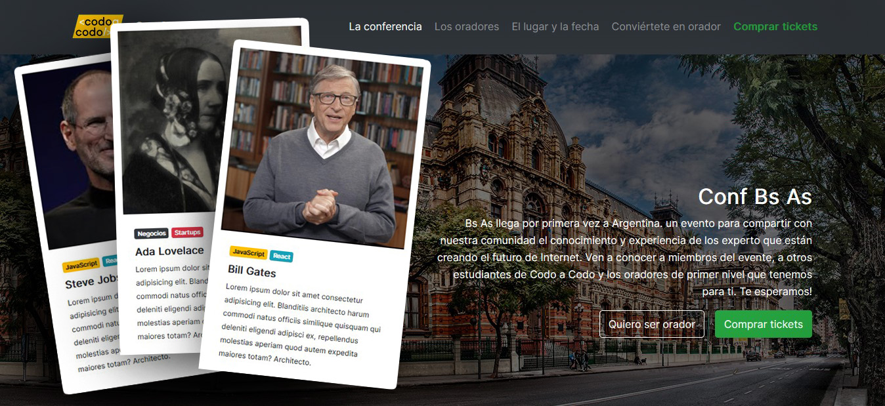

 

This simple project is the first exercise of the introductory Frontend course provided by <a href="https://www.buenosaires.gob.ar/educacion/codo-codo" target="_blank">"Codo a Codo 4.0"</a>. The layout reference and assets used for this exercise were handed by Codo a Codo.

The purpose of the exercise was to encompass all the basics concepts approached by the first part of the course: page structure and semantic HTML, CSS (vanilla CSS and <a href="https://getbootstrap.com/" target="_blank">Bootstrap</a>) & responsive web design.

 

<h2>Features</h2>

This site its just a mock of a landing page and it lacks the functionality usually associated with this kind of pages. The purpouse of this project is to showcase the understanding of the basis of HTML and CSS, and is coupled with some minor navigation behavior within the page, and some Bootstrap's components implementations (<a href="https://getbootstrap.com/docs/5.3/components/carousel/" target="_blank">carousels</a>).

 

<h2>Credits</h2>
<ul>
  <li>Special thanks to <a href="#" target="_blank">Martín Márquez</a>, teacher of this course.
  <li>You can visit <a href="https://www.buenosaires.gob.ar/educacion/codo-codo" target="_blank">Codo a Codo</a> page to access list of courses.</li>
</ul>
